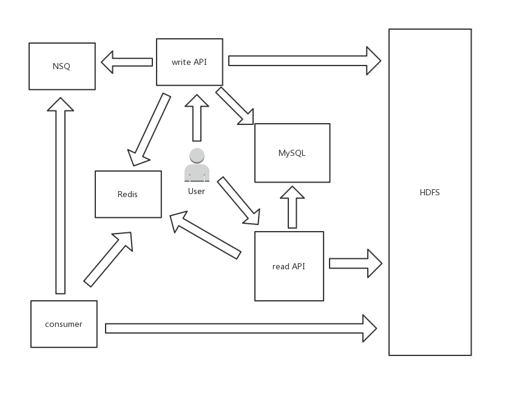

# 毕业设计

## 是什么

异步图片管理网站。

## 怎么做

### 模块

1. write_api: 写 API
2. read_api: 读 API
3. consumer: 消费者

目标：将 CPU 密集型和 IO 密集型逻辑部分由 consumer 完成。

理由：借助消息队列实现削峰。

### 数据存储

状态数据保存在独立组件中，数据存储：
1. 缓存 Redis
2. 持久化元数据存储 MySQL
3. 图片二进制数据存储 HDFS
4. NSQ 消息队列

其中 Redis 同时缓存图片元数据以及二进制数据。

因为将所有数据状态都保存在独立组件中，所以扩展性依赖于 Redis / NSQ / MySQL / HDFS。

### 系统架构

*图中小写组件为本系统设计*
